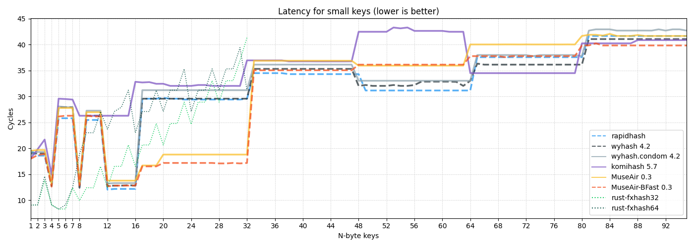

#  MuseAir

[](https://crates.io/crates/museair)
[](https://crates.io/crates/museair)
[](#)
[](https://docs.rs/museair)
[](https://github.com/eternal-io/museair)

<p align="right"><sup><b><i>English</i></b> 丨 <a href="README.zh-Hans.md">简体中文</a></sup></p>


MuseAir is a fast portable hash algorithm that:

- has the highest throughput among the portable hashes listed in SMHasher3, also provides good performance on small keys (see _Benchmark_).
- made improvements for quality and usability (see _Algorithm analysis_), [passed](results) the full [SMHasher3] `--extra` tests.

MuseAir provides two variants: `Standard` (default) and `BFast`. The former offers better quality and the latter offers better performance.

- Both variants offer 64-bit and 128-bit output with essentially the same overhead.

MuseAir is **NOT** designed for cryptographic security. You shouldn't use this for security purposes, such as ensuring that files have not been maliciously tampered with. For these use cases, consider SHA-3, Ascon or Blake3.

Besides, MuseAir-`Standard` is planned to be stable after some time (1.0.0). Due to its improved quality, it will then be available for the following purposes:

- Persistent file format
- Communication protocol
- ...

_Until then, it should only be used for local sessions!_


## Benchmarks

    AMD Ryzen 7 5700G 4.6GHz Desktop, Windows 10 22H2, rustc 1.82.0 (f6e511eec 2024-10-15)

    - SMHasher3 (34093a3 2024-06-17) runs in WSL 2 with clang 14.0.0-1ubuntu1.1


### Bulk datas

| Hash              | Digest length | Throughput (C++ - SMHasher3) | Throughput (Rust - Criterion.rs) |
|:----------------- | -------------:| ----------------------------:| --------------------------------:|
| MuseAir           |        64-bit |                   28.5 GiB/s |                       30.5 GiB/s |
| MuseAir-128       |       128-bit |                   28.5 GiB/s |                       30.4 GiB/s |
| MuseAir-BFast     |        64-bit |                   33.3 GiB/s |                       36.4 GiB/s |
| MuseAir-BFast-128 |       128-bit |                   33.3 GiB/s |                       36.3 GiB/s |
| rapidhash         |        64-bit |                   31.9 GiB/s |                       29.4 GiB/s |
| wyhash 4.2        |        64-bit |                   31.9 GiB/s |                       28.4 GiB/s |
| wyhash.condom 4.2 |        64-bit |                   25.3 GiB/s |                       22.8 GiB/s |
| komihash 5.7      |        64-bit |                   25.5 GiB/s |                              N/A |
| komihash 5.10     |        64-bit |                          N/A |                       26.8 GiB/s |

<sup>*(These results are obtained by running `./SMHasher3 --test=Speed <HASH>` and `cargo bench`)*</sup>

Peak throughput is implementation specific. But no matter what, MuseAir is the fastest for bulk datas among portable hashes, reaching 1.14x the previous fastest (wyhash).


### Small keys



<sup>*(These results are obtained by running `./SMHasher3 --test=Speed <HASH>`)*</sup>

For the more common small keys of 1-32 bytes, MuseAir has significant performance advantages. In this range, MuseAir is still the fastest on average.


## Implementations

This repository provides the official Rust implementation of MuseAir. You can find this crate on [crates.io](https://crates.io/crates/museair).

| Language | Link
|:-------- |:----
| **C**    | [eternal-io/museair-c](https://github.com/eternal-io/museair-c)
| **C++**  | [Twilight-Dream-Of-Magic/museair-cpp](https://github.com/Twilight-Dream-Of-Magic/museair-cpp)


## Algorithm analysis

First define `wide_mul` and `fold_mul`:

```rust
/// 64 x 64 -> 128 multiplication, returns lower 64-bit, then upper 64-bit.
fn wide_mul(a: u64, b: u64) -> (u64, u64) {
    x = a as u128 * b as u128;
    (x as u64, (x >> 64) as u64)
}

/// XOR-fold the lower half and the upper half of the multiplication result.
fn fold_mul(a: u64, b: u64) -> u64 {
    let (lo, hi) = wide_mul(a, b);
    lo ^ hi
}
```

**For small keys**, the reason why there is a significant speedup for 16-32 bytes is mainly because the _data hazard_ is solved:

```rust
/* not what they actually read, just to simplify the situation. */

let mut acc_i = read_u64(&bytes[0..8]);
let mut acc_j = read_u64(&bytes[8..16]);

if bytes.len() > 16 {
    let (lo0, hi0) = wide_mul(CONSTANT[2], CONSTANT[3] ^ read_u64(&bytes[16..24]));
    let (lo1, hi1) = wide_mul(CONSTANT[4], CONSTANT[5] ^ read_u64(&bytes[24..32]));
    acc_i ^= lo0 ^ hi1;
    acc_j ^= lo1 ^ hi0;
}
```

**For bulk datas**, consider wyhash's core loop:

```rust
acc0 = fold_mul(acc0 ^ read_u64(&bytes[8 * 0..]), SECRET[0] ^ read_u64(&bytes[8 * 1..]));
acc1 = fold_mul(acc1 ^ read_u64(&bytes[8 * 2..]), SECRET[1] ^ read_u64(&bytes[8 * 3..]));
acc2 = fold_mul(acc2 ^ read_u64(&bytes[8 * 4..]), SECRET[2] ^ read_u64(&bytes[8 * 5..]));
                                /* Left side */                        /* Right side */
```

actually the following problems:

1. Divide the input into multiple strips and process them separately, without diffusion between strips.
2. Direct folding after wide multiplication. Although it is beneficial to confusion and further diffusion, it will also cause a certain _entropy loss_, and possible to design collisions accordingly.
3. Once the _right side_ input happens to be the same as `SECRET[n]`, it causes one of the multipliers to be zero. Due to the nature of multiplication, the accumulator of the current strip will be destructively zeroized, and all past states will no longer exist. This situation is called "blinding multiplication" —— It is actually very easy to design collisions here, and its security comes entirely from the confidentiality of `SECRET[..]`, a set of constants that are independent of the seed. Therefore this type of attack is also called "seed-independent attack". This limits its application in communication protocols, persistent file formats, etc.

In fact, to alleviate problem 3, wyhash also proposed the `condom` mode, uses modified folding multiplication:

```rust
fn fold_mul(a: u64, b: u64) -> u64 {
    let (lo, hi) = wide_mul(a, b);
    a ^ b ^ lo ^ hi
}
```

can obviously avoid this problem now. However, when the _right side_ continues to be zero, the _left side_ inputs will not diffuse at all and will be repeatedly overwritten by subsequent inputs. Worse, performance dropped by more than 20%. At this time, there are other algorithms that are better than it, such as [komihash].

In order to solve all the above problems, MuseAir proposed the **Ring Accumulator Group** structure:

```rust
/* `wrapping_add` omitted. */

state[0] ^= read_u64(&bytes[8 * 0..]);
state[1] ^= read_u64(&bytes[8 * 1..]);
let (lo0, hi0) = wide_mul(state[0], state[1]);
state[0] += ring_prev ^ hi0;

state[1] ^= read_u64(&bytes[8 * 2..]);
state[2] ^= read_u64(&bytes[8 * 3..]);
let (lo1, hi1) = wide_mul(state[1], state[2]);
state[1] += lo0 ^ hi1;

...

state[5] ^= read_u64(&bytes[8 * 10..]);
state[0] ^= read_u64(&bytes[8 * 11..]);
let (lo5, hi5) = wide_mul(state[5], state[0]);
state[5] += lo4 ^ hi5;

ring_prev = lo5;
```

This is the accumulator group for the `Standard` variant. For the `BFast` variant, simply replace `+=` with `=`.

For problem 1 and 2, all accumulator updates come from _this_ upper 64-bit and _previous_ lower 64-bit, which has good diffusion properties.

For problem 3, since the multipliers are always dynamic and thanks to good diffusion, MuseAir is not affected by seed-independent attacks. As for blinding multiplication, the `Standard` variant does not overwrite the accumulators, is therefore not affected by this. The `BFast` variant overwrites the accumulators, which needs a brief discussion:

- After a certain read, if `state[0] == 0 && state[1] != 0`, then overwrite the accumulator will not cause any data loss. Also, `state[0]` will almost never fall into an all-zero state due to the lagging mix-in of the multiplication results.
- After a certain read, if `state[0] != 0 && state[1] == 0`, then overwrite the accumulator will cause the data of `state[0]` (the most recent 8 bytes) being lost. As for the previous datas, they have already been diffused into the entire state and is not affected. Likewise, `state[0]` will almost never fall into the all-zero state, but for `state[1]`:
  - If the next read unfortunately encounters an all-zero block, or the first byte is `0x01`, and the last seven bytes are all zeros (for universal inputs, only $2^{-127}$ probability go there), then it will remain all-zero for this round.
  - Of course it is more likely to hit a non-all-zero block. The precious upper 64-bit will bring it back from the low entropy state immediately after the next multiplication.

In summary, for universal inputs, MuseAir-BFast only has a $2^{-64}$ probability that a certain 8 bytes of input will not affect the output. Referring to wyhash, there is a $2^{-63}$ probability that the past one-third of input does not affect the output.

As for performance, its improvement mainly comes from a deep understanding of instruction-level parallelism (ILP). Benchmarks show that the performance difference between MuseAir-Standard and wyhash is less than 6%.

MuseAir-Standard will be the fastest portable hash available for communication protocols and persistent file formats.


## License

MuseAir algorithm itself is released into the public domain under the CC0 license.

These codes (implementation) in this repository are released under the MIT or Apache 2.0 dual license, at your option.


[komihash]: https://github.com/avaneev/komihash
[SMHasher3]: https://gitlab.com/fwojcik/smhasher3
