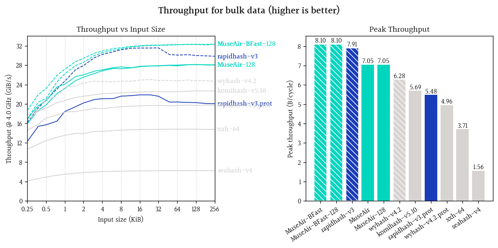
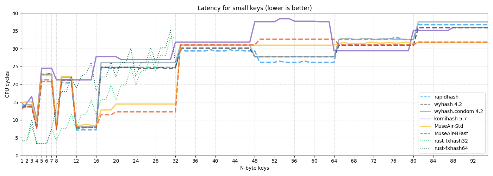

#  MuseAir Hash

> [!CAUTION]
> 
> Algorithm version **v1** has a serious flaw (see [#3](https://github.com/eternal-io/museair/issues/3) for details), so please don't use it for the time being.
> 
> I will fix it soon and release version **v1a**.

MuseAir is the top-performing portable hashing algorithm to date.

- **Improved quality** -
  Not vulnerable to blinding multiplication attacks that hinder public use (which affect [wyhash] and [rapidhash]);
  passed all [SMHasher3] tests, the de facto non-crypto hash quality standard;
  ideal for checksums such as in communication protocols and persistent file formats.
  See the [algorithm analysis](#algorithm-analysis) below for details.

- **Blazing fast** - The fastest portable hashing algorithm not affected by such attacks.

- **Various widths** - Providing 64-bit and 128-bit hash outputs with essentially the same overhead.

- **Portable** - Has no dependency on hardware-specific instructions, produces stable hash output on all platforms, and runs optimally on most 64-bit architectures.

MuseAir is **not designed for cryptographic security** and must not be used for security-critical purposes, such as protecting against malicious tampering. For such cases, consider using KangarooTwelve (K12), BLAKE3, or Ascon.

The latest stable version of the algorithm is **v1**. For stable versions, the hash output is guaranteed not to change.

The full SMHasher3 test results are in the [results](results) directory.


## Variants

MuseAir provides two variants, *Standard* and *BFast*.
If unspecified, the default is the *Standard* variant.

- The *Standard* variant is completely immune to blinding multiplication and related attacks.

- The *BFast* variant is faster than *Standard*, matching the speed of [wyhash] and [rapidhash].
  While those are susceptible to blinding multiplication, MuseAir-BFast is significantly less so.

    <details><summary><i>Details</i></summary>

    In summary, when the seed/secret is public, constructing a blinding multiplication against MuseAir-BFast
    for long inputs requires a different sequence per prefix and only corrupts the most recent 8 bytes,
    whereas for [wyhash] and [rapidhash] (without `protected` mode), a fixed sequence works for any prefix
    and corrupts a moderate portion of past bytes.
    See the [algorithm analysis](#algorithm-analysis) below for details.

    Thus, in most cases where MuseAir-Standard is acceptable, MuseAir-BFast can be used to improve performance
    without noticeable quality degradation.

    Note, however, that for the 64-bit version of MuseAir-BFast, with a fixed seed and inputs of 9-16 bytes,
    there always exists a fixed 8-byte prefix such that the content of bytes 9-16 does not affect the hash output.
    Consider using the 128-bit version of MuseAir-BFast and ADD-folding the result down to obtain a 64-bit hash output
    while avoiding this issue.

    </details>

Each variant provides two functions:

```rs
/// 64-bit version, accepts a 64-bit seed.
fn hash(bytes: &[u8], seed: u64) -> u64;

/// 128-bit version, accepts two 64-bit seeds.
fn hash128(bytes: &[u8], seed_a: u64, seed_b: u64) -> u128;
```

and two additional derived functions that fold 64-bit and 128-bit outputs using XOR and ADD, respectively:

```rs
/// 64-bit version, XOR-folded down to 32-bit.
fn hash_folded(bytes: &[u8], seed: u64) -> u32;

/// 128-bit version, ADD-folded down to 64-bit.
fn hash128_folded(bytes: &[u8], seed_a: u64, seed_b: u64) -> u64;
```

## Benchmarks

Benchmarks conducted on AMD Ryzen 7 5700G desktop, with frequency locked at 4.0 GHz.

<p align="center">
</p>

<p align="center">
</p>


## Ports

This repository provides the official Rust implementation, available on [crates.io](https://crates.io/crates/museair), or straight to [docs.rs](https://docs.rs/museair/latest/museair/).

<details><summary><i>Implementation notes</i></summary>

- Please note endianness.
- Use [verification codes](https://gitlab.com/fwojcik/smhasher3/-/blob/6ab4343396fbe0f7a1c7ac4f01d0eb9acffe4202/misc/hashverify.c) to ensure the same hashes are implemented; this avoids the need for lengthy test vectors.
    ```c
    0xFB919A7D, // MuseAir
    0x7F558188, // MuseAir.folded
    0x4041FF27, // MuseAir-128
    0xD5B53A4E, // MuseAir-128.folded
    0x79B92E70, // MuseAir-BFast
    0xF3B0F5C2, // MuseAir-BFast.folded
    0x0B4953E9, // MuseAir-BFast-128
    0x14474887, // MuseAir-BFast-128.folded
    ```
- For the *BFast* variant, loop unrolling helps achieve peak throughput; as for the *Standard* variant, this does not appear to be necessary.

</details>


## Algorithm analysis

MuseAir's core step relies on *wide multiplication* (64-bit × 64-bit → 128-bit).

From a computational perspective, multiplication can be decomposed into shifts and additions, giving it inherent diffusion properties.
On most modern processors, multiplication is a single-instruction operation. Compared to manually combining multiple bitwise operations, wide multiplication offers significant advantages in performance and implementation complexity.
Thus, many recent non-crypto hashing algorithms (e.g., [wyhash], [rapidhash], [komihash]) rely on this primitive.

The core steps of wyhash and rapidhash look like this, in a loop, large inputs are split into lanes:

```rs
lane0 = fold_mul(lane0 ^ Input[0], Input[1] ^ SECRET[0]);
lane1 = fold_mul(lane1 ^ Input[2], Input[3] ^ SECRET[1]);
lane2 = fold_mul(lane2 ^ Input[4], Input[5] ^ SECRET[2]);
// ...more lanes possible...
```

Here, `fold_mul` is a *folding multiplication*: it performs a 128-bit wide multiplication and returns the XOR of its lower and upper 64-bit halves. `SECRET` is a set of magic constants to add entropy to the state.

At first glance, this seems fine. Wide multiplication ensures full diffusion within each lane, and splitting inputs into lanes enables instruction-level parallelism (ILP). Right?

If only it were that simple. We must consider all scenarios, especially those related to multiplication's fundamental properties.
In the example above, what if `input[1] ^ SECRET[0] == 0`? Boom! A puff of magic smoke later, `lane0` becomes zero. All information in that lane is lost, and prior inputs in the lane won't affect the final result!
This is known as *blinding multiplication*. Adding more lanes doesn't help, as all lanes are susceptible.

> *We shouldn't forget that "zero times anything equals zero!"*

From this perspective, if `SECRET`s must be public, even CRCs (Cyclic Redundancy Check) offer better security properties (though they are all non-cryptographic).
If you're designing a persistent file format or communication protocol and want a fast checksum, you wouldn't want to use wyhash or rapidhash&mdash;they're *too easy* to break for such uses!

To address these problems, MuseAir introduces the circular accumulator structure:

```rs
state[0] ^= input[0];
state[1] ^= input[1];
(lo0, hi0) = wide_mul(state[0], state[1]);
state[0] = lo5 ^ hi0;

state[1] ^= input[2];
state[2] ^= input[3];
(lo1, hi1) = wide_mul(state[1], state[2]);
state[1] = lo0 ^ hi1;

state[2] ^= input[4];
state[3] ^= input[5];
(lo1, hi1) = wide_mul(state[2], state[3]);
state[2] = lo1 ^ hi2;

...

state[5] ^= input[10];
state[0] ^= input[11];
(lo5, hi5) = wide_mul(state[5], state[0]);
state[5] = lo4 ^ hi5;
```

This is the accumulator array for the *BFast* variant. Here, `wide_mul` performs a wide multiplication and returns a tuple containing the lower and upper 64-bit results, respectively.

1. Inputs are **not split into multiple independent lanes**, leading to superior diffusion: Every bit of input eventually influences all accumulators. Unlike wyhash or rapidhash, where an input bit can only affect a moderate portion of the accumulators.

2. Inputs are **not directly mixed with constants or seeds**, which significantly heightens the difficulty of intentionally crafting a blinding multiplication: Even if the seed and constants are public, an attacker must track how all previous inputs have acted upon the accumulator array. Unlike wyhash or rapidhash, which are fragile under such scrutiny.

    In short, constructing a blinding multiplication here for long inputs requires a different sequence per prefix;
    whereas for wyhash and rapidhash (without `protected` mode), a fixed sequence works for any prefix.

Because earlier inputs have already permeated the accumulator array, even if a blinding multiplication occurs,
in most cases, it only corrupts the **most recent 8 bytes** (does not affect the hash output).
Unlike wyhash or rapidhash, blinding multiplications can easily corrupt **a moderate portion** of past bytes!

3. This structure interleaves the wide multiplication result. Thus, for general inputs, the probability of a blinding multiplication leading to an accumulator zero out is only $2^{-127}$, far lower than the $2^{-63}$ found in wyhash and rapidhash. The reasoning is as follows:

    - For general inputs, each `input[N]` can be treated as an independent random variable with $2^{64}$ possible states.

    - In wyhash and rapidhash, when `input[0] == lane0` OR `input[1] == SECRET[0]`, both inputs corrupted. The probability of this occurring is $2^{-64} \times 2 = 2^{-63}$. Following this:
        - `lane0` immediately collapses to zero. Due to the lack of inter-lane diffusion, a moderate portion of past inputs was also corrupted.

    - In the *BFast* variant, `input[0]` corrupted only when `input[1] == state[1]`, with a probability of $2^{-64}$. However:
        - `state[0]` is highly unlikely to collapse to zero, thanks to the lagged mixing of multiplication results.
        - For `state[0]` to zero out, `lo5` must also be zero. This requires the previous step to have also encountered a blinding multiplication (where `input[-2] == state[5]` OR `input[-1] == state[0]`), which has a probability of $2^{-63}$.
        - Thus, the cumulative probability of `state[0]` zero out is $2^{-64} \times 2^{-63} = 2^{-127}$.
        - Even in such an event, the impact is localized because earlier inputs have already permeated the accumulator array.

4. This structure is designed to be highly conducive to instruction-level parallelism (ILP). Throughput should reach the theoretical limits of modern processors (pure scalar, performing 1 multiplication and 3 XORs per 16 bytes), while maintaining quality above the baseline.

Finally, the *Standard* variant simply replaces all assignments (`=`) in the accumulator array with sub assignments (`-=`),
completely immunizing the algorithm against blinding multiplication at minimal performance cost.

#### Bad seed avoidance

- For long inputs, use masked mixing:
    ```rs
    state = [
        CONSTANT[0] ^ (seed & MASK_A),
        CONSTANT[1] ^ (seed & MASK_B),
        ...
    ];
    ```
    to ensure the initial state contains no zeros.

- For short inputs, the multiplication used to spread the seed takes the form:
    ```rs
    wide_mul(CONSTANT[2] ^ seed ^ len, CONSTANT[3] ^ len);
    ```
    ensuring that unique seed and length information is always mixed into the state.


## License

The MuseAir hashing algorithm itself and its reference implementation [`museair.cpp`](museair.cpp),
are released into the public domain under CC0 1.0.

All other code in this repository is dual-licensed under MIT and Apache 2.0, at your option.


[wyhash]: https://github.com/wangyi-fudan/wyhash
[rapidhash]: https://github.com/Nicoshev/rapidhash
[komihash]: https://github.com/avaneev/komihash
[SMHasher3]: https://gitlab.com/fwojcik/smhasher3
