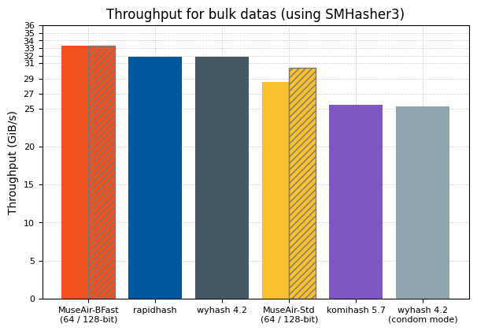
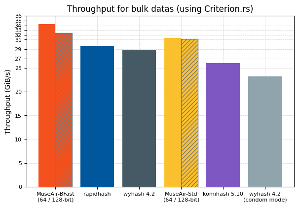

#  MuseAir

[](https://crates.io/crates/museair)
[](https://crates.io/crates/museair)
[](#)
[](https://docs.rs/museair)
[](https://github.com/eternal-io/museair)

<p align="right"><sup><b><i>English</i></b> 丨 <a href="README.zh-Hans.md">简体中文</a></sup></p>

MuseAir is **a portable hashing algorithm** that heavily optimized for [performance](#benchmarks) and [quality](#quality), incorporating structures never before implemented. It offers two variants: `Standard` and `BFast`. The latter is faster but slightly *lower* in quality. For detailed differences, refer to the [algorithm analysis](#algorithm-analysis) below.

MuseAir is **not designed for cryptographic security** and should not be used for security-critical purposes like protection against malicious tampering. For such cases, consider SHA-3, Ascon, or Blake3 instead.

MuseAir is **currently unstable** and its output may change between minor versions. Therefore, it is not yet recommended for persistent formats.


## Benchmarks

    AMD Ryzen 7 5700G 4.6GHz Desktop, Windows 10 22H2, rustc 1.87.0 (17067e9ac 2025-05-09)

    - SMHasher3 (4568f81 2025-3-22) runs in WSL 2 with clang 14.0.0-1ubuntu1.1

Only simple charts are provided for now. If you'd like more detailed comparisons and are willing to contribute, please open an issue.

### Hashing bulk datas

<table width="100%"><tr>
<td></td>
<td></td>
</tr></table>

- wyhash: [original](https://github.com/wangyi-fudan/wyhash), [rust-impl](https://github.com/thynson/wyhash-final4)
- rapidhash: [original](https://github.com/Nicoshev/rapidhash), [rust-impl](https://github.com/hoxxep/rapidhash)
- komihash: [original](https://github.com/avaneev/komihash), [rust-impl](https://github.com/thynson/rust-komihash)

### Hashing small keys


<p align="center"><sup>For common 1-32 byte keys, MuseAir has a significant speed advantage (avg. 13.0 cycles/hash), even outperforming fxhash.</sup></p>


## Quality

All MuseAir variants have passed the complete [SMHasher3](https://gitlab.com/fwojcik/smhasher3) extended test suite (with `--extra` flag). As the de facto standard for non-cryptographic hashing quality, passing these tests confirms production readiness. See full results in the [results](results) directory.

> *Since the core algorithm's quality has been verified with no major changes expected, only BFast_64-bit test results are provided after version 0.4.*


## Implementations

This repository provides the official Rust implementation, available on [crates.io](https://crates.io/crates/museair).

#### Third-party

| Language | Link | Note
|:-------- |:---- |:----
| **C**    | [eternal-io/museair-c](https://github.com/eternal-io/museair-c) | *Abandoned, new implementations welcome*
| **C++**  | [Twilight-Dream-Of-Magic/museair-cpp](https://github.com/Twilight-Dream-Of-Magic/museair-cpp)


## Algorithm analysis

### TL;DR

- Even the slightly *lower*-quality `BFast` variant offers better quality than other competitors while delivering the best performance -- this is the reason you should use MuseAir.
- The higher-quality `Standard` variant is entirely immune to blinding multiplication while maintaining excellent performance, making it suitable for persistent file formats or communication protocols (though note the algorithm is not yet stable).

### Handling small keys

The [chart](#small-keys) shows MuseAir's significant speed advantage for 16-32 byte keys. This is due to its resolution of _data hazards_: processing bytes 16-32 doesn't wait for bytes 0-16, effectively utilizing pipelining to reduce latency.

### Handling bulk datas

MuseAir's core step relies on *wide multiplication* (64-bit × 64-bit → 128-bit).

From a computational perspective, multiplication can be decomposed into shifts and additions, giving it inherent confusion and diffusion properties. On most modern processors, multiplication requires just one instruction. Compared to manually combining other operations, wide multiplication offers significant advantages in performance and implementation complexity. Thus, many recent non-crypto hashing algorithms (e.g., [wyhash], [rapidhash], [komihash]) rely on it.

The core steps of wyhash and rapidhash look like this: in a loop, large inputs are split into lanes...

```rust
lane0 = fold_mul( lane0 ^ input[0], CONSTANT[0] ^ input[1] );
lane1 = fold_mul( lane1 ^ input[2], CONSTANT[1] ^ input[3] );
lane2 = fold_mul( lane2 ^ input[4], CONSTANT[2] ^ input[5] );
// ...more lanes possible...
```

Here, `fold_mul` is a *folding multiplication*: it performs a wide multiplication and XORs the high and low 64 bits of the result. `CONSTANT` is a set of magic constants to add entropy to the state.

At first glance, this seems fine. Wide multiplication ensures full diffusion within each lane, and splitting inputs into lanes enables instruction-level parallelism. Right?

If only it were that simple. We must consider all scenarios, especially those related to multiplication's fundamental properties. In the example above, what if `CONSTANT[0] ^ input[1] == 0`? Boom! A puff of magic smoke later, `lane0` becomes zero. All information in that lane is lost, and prior inputs in the lane won't affect the final result! This is known as *blinding multiplication*. Adding more lanes doesn't help, as all lanes are susceptible.

> We shouldn't forget that "*zero times anything equals zero*!"

From this perspective, if `CONSTANT` must be public, even CRCs (cyclic redundancy checks) offer better security properties -- though they are all non-cryptographic. If you're designing a persistent file format or communication protocol and want a simple checksum, you wouldn't want to use wyhash or rapidhash -- they're *too easy* to break for such uses! Providing *a fast hashing algorithm without these glaring issues* was MuseAir's design motivation.

---

To address these problems, MuseAir introduces the **Ring Accumulator Group** structure:

```rust
state[0] ^= input[0];
state[1] ^= input[1];
(lo0, hi0) = wide_mul(state[0], state[1]);
state[0] = lo5 ^ hi0;

state[1] ^= input[2];
state[2] ^= input[3];
(lo1, hi1) = wide_mul(state[1], state[2]);
state[1] = lo0 ^ hi1;

state[2] ^= input[4];
state[3] ^= input[5];
(lo1, hi1) = wide_mul(state[2], state[3]);
state[2] = lo1 ^ hi2;

...

state[5] ^= input[10];
state[0] ^= input[11];
(lo5, hi5) = wide_mul(state[5], state[0]);
state[5] = lo4 ^ hi5;
```

This is the accumulator group for the `BFast` variant. Here, `wide_mul` performs a 128-bit wide multiplication, returning a tuple of the low and high 64 bits. Since there's no direct mixing with constants, both the probability and impact of blinding multiplication are dramatically reduced. Even with crafted inputs, typically only the most recent 8 bytes might not affect the output -- unlike wyhash or rapidhash, where a third of prior inputs can easily be made irrelevant!

The `Standard` variant replaces all `=` with `+=`, making it entirely immune to blinding multiplication.

Additionally, since inputs aren't split into lanes, MuseAir offers better diffusion: every input bit may eventually affect the entire state, unlike wyhash or rapidhash, where inputs affect at most a third of the state.

Thus, combining [performance](#performance), we conclude:

- Even the slightly *lower*-quality `BFast` variant offers better quality than other competitors while delivering the best performance -- this is the reason you should use MuseAir.
- The higher-quality `Standard` variant is entirely immune to blinding multiplication while maintaining excellent performance, making it suitable for persistent file formats or communication protocols (though note the algorithm is not yet stable).


## License

The MuseAir hashing algorithm itself and its reference implementation [`museair.cpp`](museair.cpp) are released into the public domain under CC0 1.0.

All other code in this repository is dual-licensed under MIT and Apache 2.0, at your option.


[wyhash]: https://github.com/wangyi-fudan/wyhash
[rapidhash]: https://github.com/Nicoshev/rapidhash
[komihash]: https://github.com/avaneev/komihash
